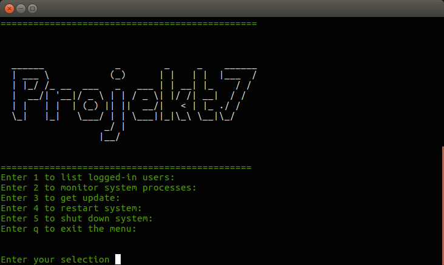

# linuxterminalmenu

Description
-----------------------------------------------------
Very basic menu interface to speed up basic task on the terminal.
Current version does not have many menu options but more complex options can be added.

How to set up the menu to execute everytime you log in to the terminal:
-----------------------------------------------------
Put the following code at the end of the user's .bashrc file: 

/path/to/your/script.sh

To edit the .bashrc file, open the terminal and type:
-----------------------------------------------------

vi ~youruser/.bashrc

That's it, now everytime the user opens the terminal it will automatically execute and display the menu.
(REMEMBER TO CHANGE THE PATHS ACCORDING TO YOURS,DO NOT COPY PASTE THE CODE EXACTLY THE WAY IT IS HERE.)

If you want to use the monitor system processes option you need to install the following program:
------------------------------------------------------
apt-get install htop

